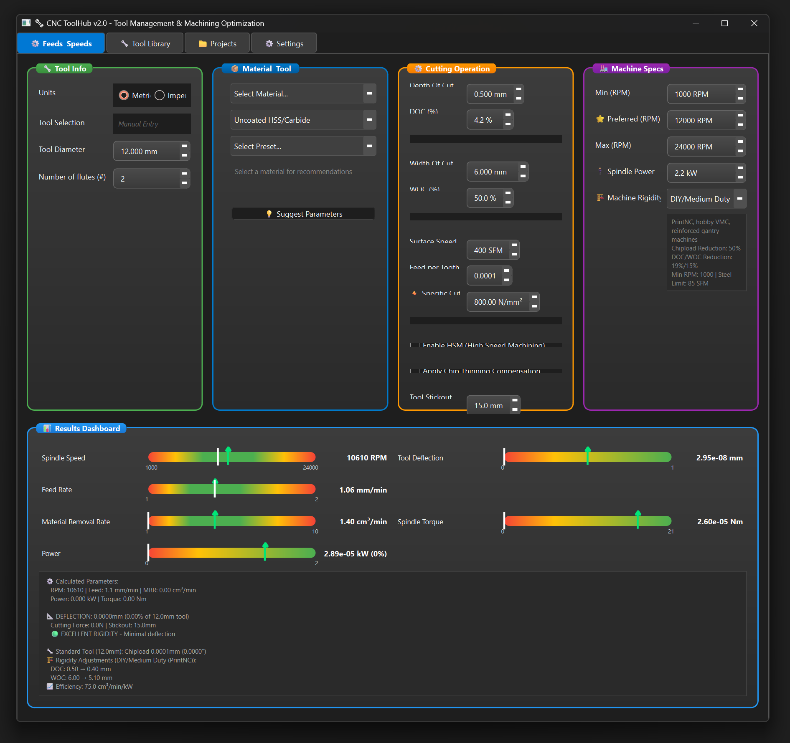
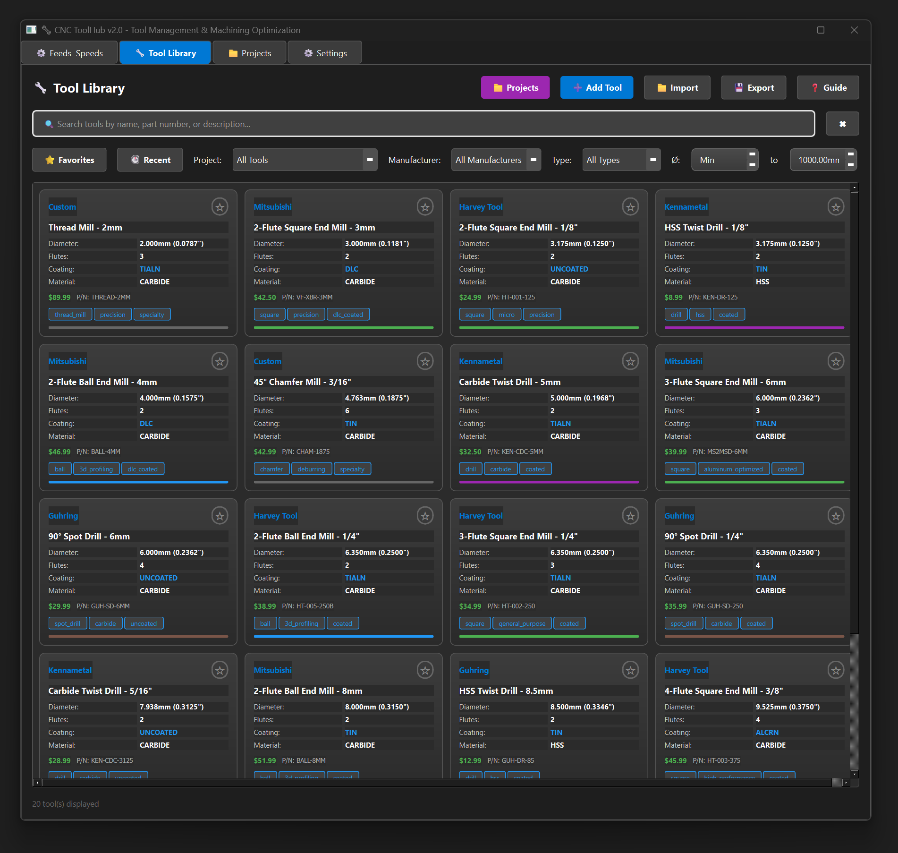
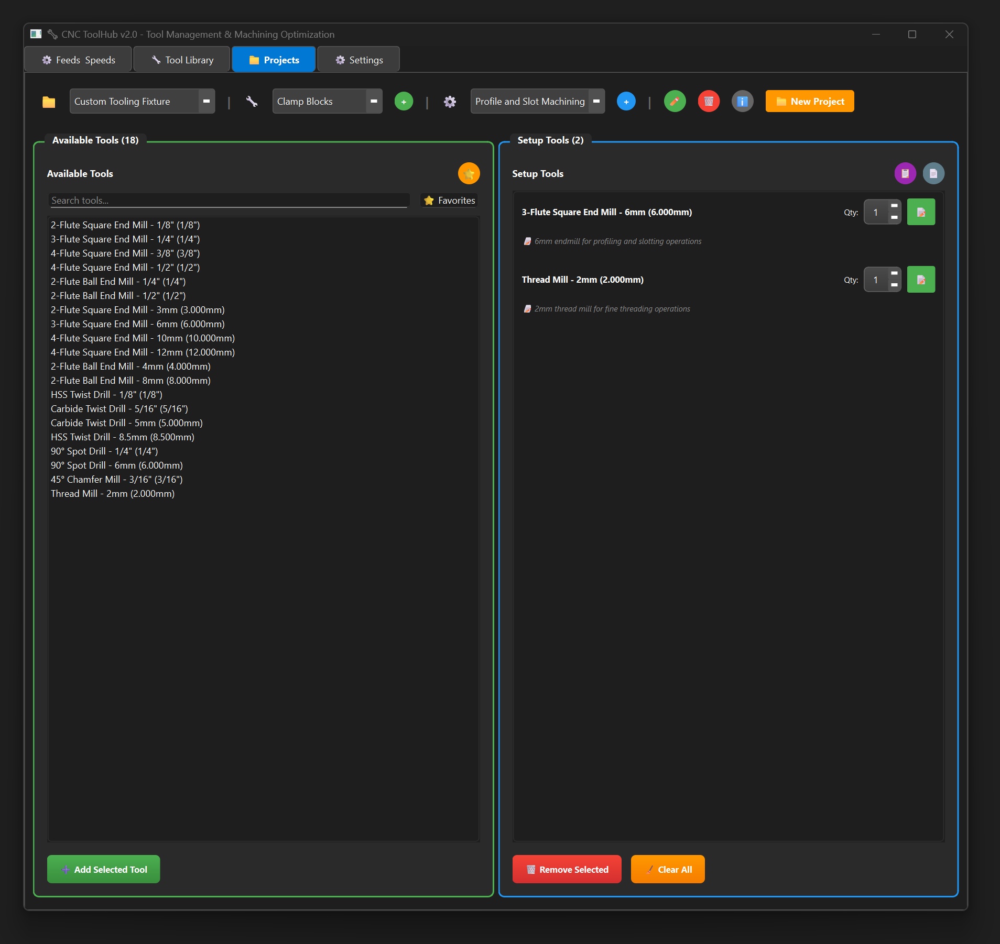
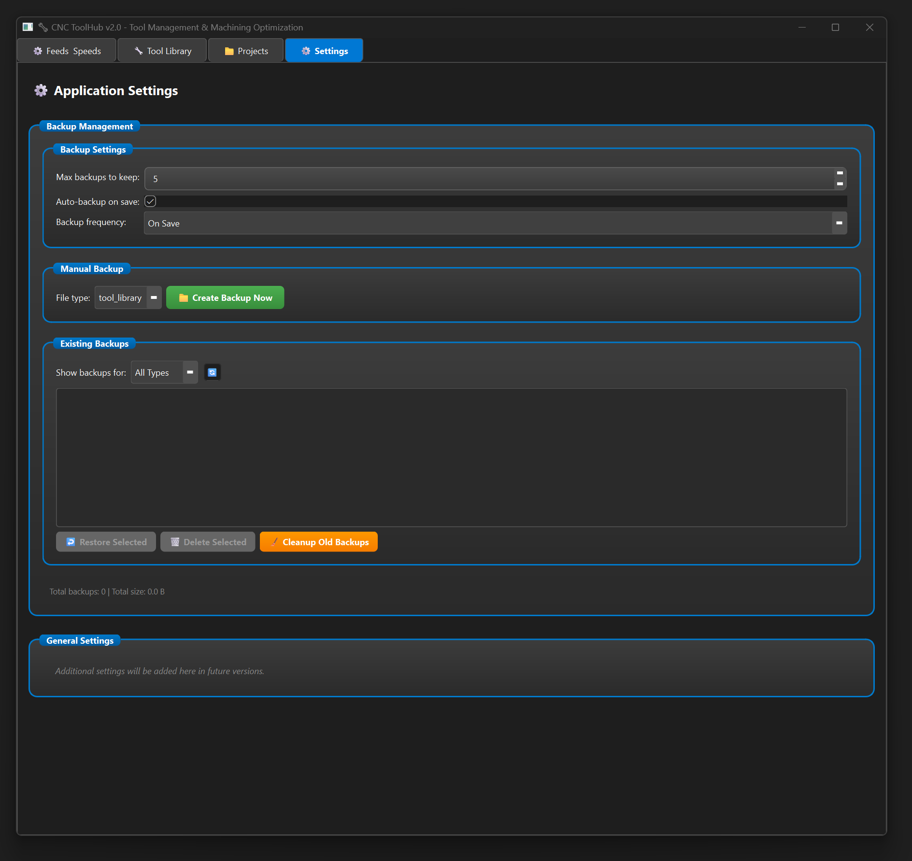

# CNC ToolHub

A comprehensive desktop application for CNC tool management, project organization, and cutting parameter optimization. Combines advanced machining calculations with project-based tool organization, material databases, and real-time parameter validation for professional CNC operations.



## Key Features

### Advanced Machining Calculations
- **Standard & Micro Tool Support**: Optimized calculations for tools ≥3mm and <3mm
- **HSM (High Speed Machining)**: Chip thinning compensation and advanced algorithms
- **Tool Deflection Analysis**: Cantilever beam theory with deflection warnings
- **Machine Rigidity Adjustment**: Router, DIY/Medium, and Industrial VMC settings
- **Real-time Parameter Validation**: Comprehensive warnings and recommendations

### Tool & Project Management
- **Project-Based Organization**: Organize tools by project with quantity tracking
- **Comprehensive Tool Library**: Browse and filter extensive tool database
- **Material Database**: Extensive material properties with coating multipliers
- **Dual Unit System**: Seamless metric/imperial conversion with real-time switching

## Application Overview

### Feeds & Speeds Calculator


The core machining calculation engine that computes optimal cutting parameters:

**Input Parameters:**
- Tool diameter and flute count with unit conversion
- Material selection with automatic property loading
- Cutting parameters (depth/width of cut, surface speed, feed per tooth)
- Machine specifications and rigidity settings
- Advanced options (HSM mode, tool stickout, chip thinning)

**Calculated Results:**
- Spindle Speed (RPM)
- Feed Rate (IPM/mm/min)
- Material Removal Rate (MRR)
- Cutting forces and power requirements
- Tool deflection analysis with warnings

**Key Formulas:**
- **RPM**: `(Surface Speed × 1000) / (π × Tool Diameter)`
- **Feed Rate**: `RPM × Feed per Tooth × Flute Count`
- **MRR**: `Width of Cut × Depth of Cut × Feed Rate`

### Tool Library



Comprehensive tool database with advanced filtering and management:

**Features:**
- Browse extensive tool database with specifications
- Filter by diameter, flute count, coating, application
- View detailed tool information and recommendations
- Material, application, and coating reference guides
- Export tool data for external use

**Tool Categories:**
- End mills (standard, micro, specialty)
- Drill bits and reamers  
- Face mills and fly cutters
- Custom tool definitions

### Project Manager



Project-based tool organization and workflow management:

**Project Management:**
- Create and organize multiple CNC projects
- Assign tools to projects with quantities and notes
- Track project progress and tool usage
- Import/export project data
- Project-specific cutting parameters

**Tool Assignment:**
- Assign specific tools from library to projects
- Track tool quantities and availability
- Add project-specific notes and parameters
- Generate tool lists and setup sheets

### Settings & Configuration



System configuration and data management:

**Configuration Options:**
- Unit system preferences (metric/imperial)
- Default machine settings and rigidity
- Application theme and interface options
- Data file locations and backup settings

**Data Management:**
- Import/export tool library data
- Backup and restore project files
- Material database updates
- System diagnostics and file verification

## Installation

### Pre-built Executable (Recommended)

Download the latest Windows executable from the [Releases](https://github.com/bhowiebkr/CNC-ToolHub/releases) page. No Python installation required.

### From Source

**Requirements:**
- Python 3.11
- PySide6

**Installation:**
```bash
git clone https://github.com/bhowiebkr/CNC-ToolHub.git
cd CNC-ToolHub
pip install -r requirements.txt
```

**Run:**
```bash
# Windows
run.bat

# Or directly with Python
python src/cnc_toolhub.py
```

## Technical Specifications

### Calculation Engine
- **Strategy Pattern**: Automatic selection between standard and micro tool calculators
- **Physics-Based**: Cantilever beam theory for deflection analysis
- **Industry Standards**: Formulas from garrtool.com and major tooling manufacturers
- **Machine Aware**: Rigidity adjustments for Router, DIY, and Industrial VMC

### Architecture
- **Modular Design**: Separate packages for calculators, formulas, UI components
- **Qt Framework**: PySide6 for cross-platform GUI
- **JSON Data**: Human-readable material and tool databases
- **Real-time Updates**: Automatic recalculation on parameter changes

## System Requirements

- Windows 10/11 (64-bit)
- 50 MB available disk space
- No additional software dependencies for pre-built executable

## Building from Source

For detailed build instructions including Nuitka compilation, see [BUILD.md](BUILD.md).

## Testing

Run the test suite to verify calculations:
```bash
# Windows
run_tests.bat

# Or directly with Python
python run_tests.py
```

## License

Open source project. See repository for license details.

## References

Machining formulas based on industry standards from [garrtool.com](https://www.garrtool.com/resources/machining-formulas/).