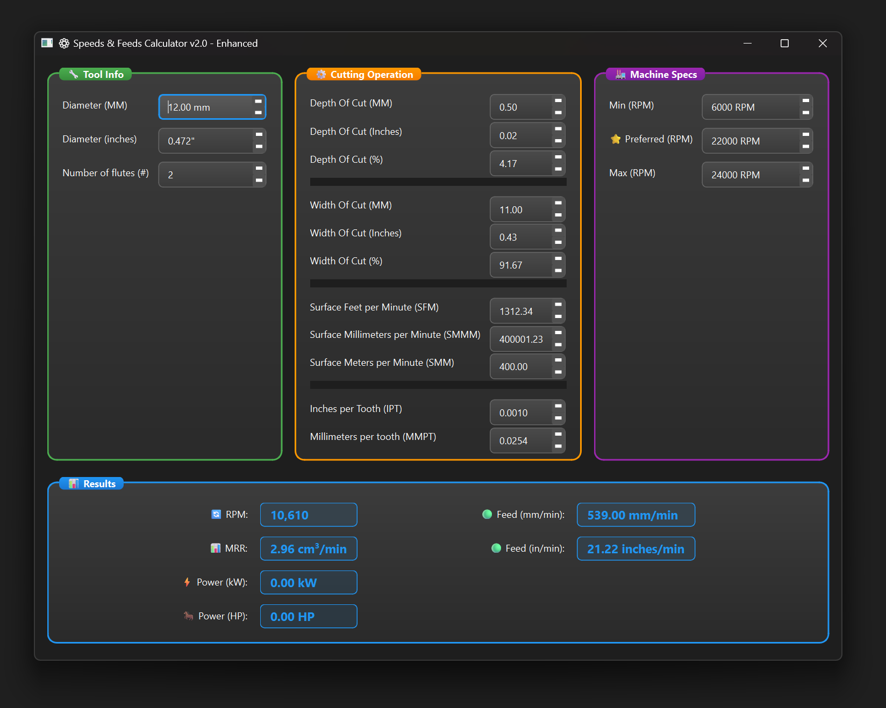

# CNC ToolHub

A comprehensive desktop application for CNC tool management, project organization, and cutting parameter optimization. Combines advanced machining calculations with project-based tool organization, material databases, and real-time parameter validation for professional CNC operations.



## Features

### Tool Management & Organization
- **Project-Based Tool Organization**: Organize tools by project with quantity tracking
- **Comprehensive Tool Library**: Browse and filter extensive tool database
- **Tool Assignment**: Assign specific tools to projects with notes and quantities

### Advanced Machining Calculations
- **Standard & Micro Tool Support**: Optimized calculations for tools ≥3mm and <3mm
- **HSM (High Speed Machining)**: Chip thinning compensation and advanced algorithms
- **Tool Deflection Analysis**: Cantilever beam theory with deflection warnings
- **Machine Rigidity Adjustment**: Router, DIY/Medium, and Industrial VMC settings
- **Real-time Parameter Validation**: Comprehensive warnings and recommendations

### User Interface & Workflow  
- **Dual Unit System**: Seamless metric/imperial conversion with real-time switching
- **Graphical Dashboard**: Visual feedback with gradient bars and status indicators
- **Material Database**: Extensive material properties with coating multipliers
- **Project Management**: Create, track, and manage multiple CNC projects

## Calculations

The application computes the following machining parameters:

- **Spindle Speed (RPM)**: `RPM = (Surface Speed × 1000) / (π × Tool Diameter)`
- **Feed Rate**: `Feed = RPM × Feed per Tooth × Number of Flutes`
- **Material Removal Rate (MRR)**: `MRR = Width of Cut × Depth of Cut × Feed Rate`

## Installation

### Pre-built Executable (Recommended)

Download the latest Windows executable from the [Releases](https://github.com/bhowiebkr/CNC-ToolHub/releases) page. No Python installation required.

### From Source

**Requirements:**
- Python 3.11
- PySide6

**Installation:**
```bash
git clone https://github.com/bhowiebkr/CNC-ToolHub.git
cd CNC-ToolHub
pip install -r requirements.txt
```

**Run:**
```bash
# Windows
run.bat

# Or directly with Python
python speeds_and_feeds.py
```

## Usage

1. **Tool Setup**: Enter tool diameter and number of flutes
2. **Cutting Parameters**: Set depth of cut, width of cut, and desired surface speed
3. **Feed Rate**: Specify feed per tooth based on material and tool manufacturer recommendations
4. **Machine Limits**: Configure spindle RPM constraints
5. **Results**: View calculated RPM, feed rate, and material removal rate

### Input Parameters

- **Tool Diameter**: Cutting tool diameter (mm or inches)
- **Flute Count**: Number of cutting edges on the tool
- **Depth of Cut (DOC)**: Axial cutting depth (mm or inches)
- **Width of Cut (WOC)**: Radial cutting width (mm or inches)
- **Surface Speed**: Cutting speed (SFM or m/min)
- **Feed per Tooth**: Chip load per cutting edge (inches or mm per tooth)

### Output Values

- **Spindle Speed**: Calculated RPM for the spindle
- **Feed Rate**: Table feed rate (IPM or mm/min)
- **Material Removal Rate**: Volume of material removed per unit time

## System Requirements

- Windows 10/11 (64-bit)
- 50 MB available disk space
- No additional software dependencies for pre-built executable

## Building from Source

For detailed build instructions including Nuitka compilation, see [BUILD.md](BUILD.md).

## Testing

Run the test suite to verify calculations:
```bash
# Windows
run_tests.bat

# Or directly with Python
python run_tests.py
```

## License

Open source project. See repository for license details.

## Formula References

Machining formulas based on industry standards referenced from [garrtool.com](https://www.garrtool.com/resources/machining-formulas/).